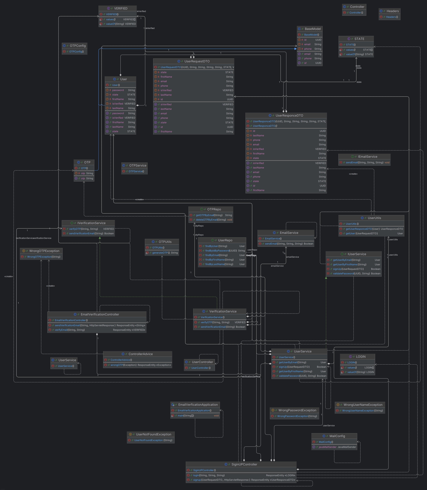

# List Tool's and Teach used

1. Rest api
2. 3rd party API integration
3. Headers
4. cookies
5. loggers
6. swagger
7. DTO's
8. Exceptions and Controller Advice
9. Custom Querys
10. SMTP email servers (google)
11.

#### Swagger link

http://localhost:8080/swagger-ui/index.html

# Initial Class Design

# Actually Implementation

* MODELS
* REPOS
* SERVICES
* CONTROLLERS
* DTO'S
* EXCEPTIONS
* CONFIG
* UTILS
* CONSTENTS
* RESOURCES
  * DB MIGRATIONS BASED ON VERSIONS
  * IMAGES
  * QUERYS
* APPLICATION.PROPERITES
  * LOGGERS
  * DB CONFIG
  * SMTP CONFIG FOR EMAIL SERVICES

